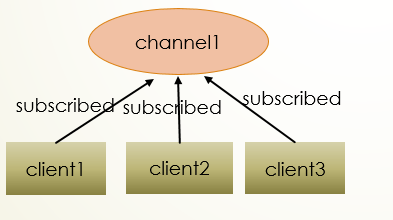
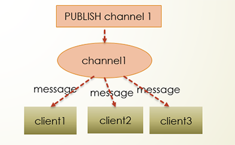

# PubSub

"Publish/Subscribe" is a message-handling model, generally used for abstracting long-lasting business logic. Commonly used middleware such as `redis` and `kafka` support this messaging mode. `CONNMIX` provides PubSub support within the service mesh.

## PubSub Mechanism

Three clients are subscribed to the `channel1` channel.



When a new message is published to `channel1` through the `publish` command, this message will be sent to all clients subscribed to this channel.



Example: Suppose a user with UID 1001 has three devices: a mobile phone, PC, and tablet, and all three terminals are using our APP simultaneously. When designing the PubSub model, we only need to design the channel name as `user:1001`. When opening any terminal's APP, `subscribe` to the channel `user:1001`. Now when we need to push a message proactively to the user, simply `publish` to the channel `user:1001`, without worrying about how many socket connections the user currently has. This abstract design can significantly reduce code complexity and availability.

## CONNMIX PubSub

CONNMIX provides PubSub support within the service mesh and can be used in the following ways:

- Subscribe to the channel using the connection object in the server-side Lua code.

Channels can be any string, with no restrictions other than not containing spaces and not being recommended to use Chinese characters. Just keep it consistent with the message sender to receive messages. Channels can be your live room ID or a user's UID, and you can subscribe to multiple channels. Channels do not need to be created and can be discarded as needed.

```lua
err = conn:subscribe("channel1")
```

- You can proactively push messages through the following methods in the server-side Lua code on any node, and other node connections can also receive messages.

```lua
success, fail = mix.mesh.publish("channel1", "Hello,World!")
```

- The server-side can use Java, PHP, Go, Node.js, Python, C#, or any other language to proactively push messages through the API request. You can also use [websocket-api push](en-us/websocket-api?id=grid-publishing-it-can-be-sent-to-all-client-connections-that-have-subscribed-to-these-channels-in-the-entire-grid-1) to improve performance.

```bash
curl --request POST 'http://127.0.0.1:6789/v1/mesh/publish' \
--header 'Content-Type: application/json' \
--data-raw '{
    "c": "channel1",
    "d": "Hello,World!"
}'
```
