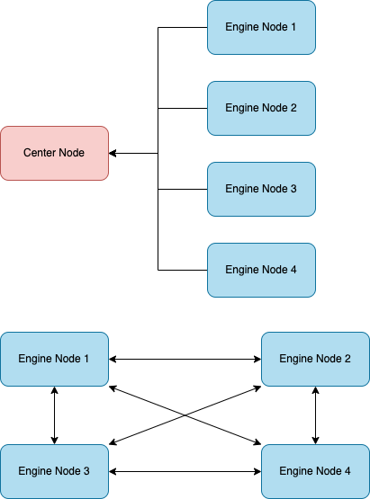
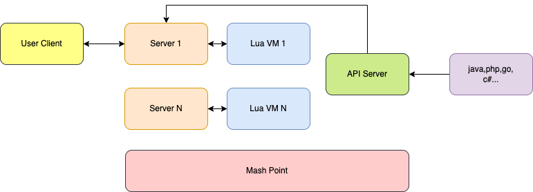

# Working Principle

CONNMIX encapsulates the complex network scheduling of distributed systems into middleware, with built-in native pubsub infrastructure. Through a small amount of Lua script, you can complete the backend business logic and provide intranet calls through rest/websocket-api. It can quickly integrate high-performance distributed long connection services into any existing systems written in any language.

## Service Mesh

- The entire system is composed of Center and Engine nodes.
- Center nodes are responsible for service registration, while Engine nodes are responsible for logic processing.
- Engine nodes are registered with the Center Node when they start up.
- Engine nodes will automatically form a service mesh, so the connections of each node can communicate with the connections of other nodes.
- The registration and networking of Engine nodes are automatically completed, so if performance or the number of connections is not enough, starting a new Engine node can achieve expansion.
- Engine nodes themselves are servers of various communication protocols and provide services externally. External requests directly connect to the ports of Engine nodes.

## Gateway Node

- Server is responsible for providing external services, accepting and responding to data according to the configured protocol type, and each Server runs a set of Lua code to start an independent Lua VM for executing business logic.
- websocket protocol: Business logic can be written in Lua code, such as pushing reported data to Redis or subscribing to a channel for proactive push.
- socket protocol: In addition to the business logic, network communication protocols can also be customized using Lua code, and Lua API can be used to parse the data within the protocol.
- Through ApiServer, we can call http/websocket APIs to complete proactive push.
- When calling ApiServer to execute send, publish, if client_id is not in the current node, the Engine Node will automatically find the corresponding node's Mesh Point and forward it. Therefore, users do not need to handle the distributed problems caused by cross-machine when using it.
