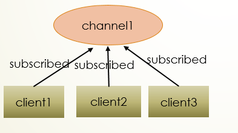

# PubSub 发布订阅

“发布/订阅”是一种消息处理模型，通常用于长连接的业务逻辑抽象处理，我们常用的 `redis`、`kafka` 中间件都支持该模式的消息处理，`CONNMIX` 在服务网格内部提供了PubSub的支持。

## PubSub 机制

三个客户端都订阅 `channel1` 频道。



当有新消息通过 `publish` 命令发布到 `channel1` 时，这个消息会被发送给订阅这个频道的所有客户端。


举例：假设用户uid为1001的用户有3个设备，分别为：手机、PC、平板，3个终端同时在使用我们的APP，我们设计 PubSub 模型时，只需设计 channel 名称为 `user:1001`，在打开任意端APP时，`subscribe` 通道 `user:1001`，此时当我们需要主动给该用户推送消息时，只需 `publish` 到通道 `user:1001` 即可，而无需关心这个用户当前到底有多少个socket连接，通过这种抽象设计能显著的降低代码复杂度和可用性。

## CONNMIX PubSub

CONNMIX 在服务网格内部提供了 PubSub 支持，有以下几种使用方式：

- 在服务端lua代码中使用连接对象订阅通道。

channel可以为任意字符串，除了不能包含空格，和不建议使用中文外，没有任何限制，只需要和消息的发送端保持一致，就可以收到消息。channel可以是您直播间的id，也可以是一个用户的uid，可以订阅多个channel，channel不需要创建，可随用随弃。

```lua
err = conn:subscribe("channel1")
```

- 在任意节点服务端lua代码中可通过以下方法主动推送消息，其他节点的连接也可以收到消息。

```lua
success, fail = mix.mesh.publish("channel1", "Hello,World!")
```

- 在服务端可以用 java,php,go,nodejs,py,c# 等任意语言通过API请求主动推送消息，还可以用 [websocket-api推送](zh-cn/websocket-api?id=%e7%bd%91%e6%a0%bc%e5%8f%91%e5%b8%83%ef%bc%9a%e5%8f%af%e4%bb%a5%e5%8f%91%e9%80%81%e7%bb%99%e6%95%b4%e4%b8%aa%e7%bd%91%e6%a0%bc%e5%86%85%e6%89%80%e6%9c%89%e8%ae%a2%e9%98%85%e4%ba%86%e8%bf%99%e4%ba%9b%e9%a2%91%e9%81%93%e7%9a%84%e5%ae%a2%e6%88%b7%e7%ab%af%e8%bf%9e%e6%8e%a5-1) 提升性能。

```bash
curl --request POST 'http://127.0.0.1:6789/v1/mesh/publish' \
--header 'Content-Type: application/json' \
--data-raw '{
    "c": "channel1",
    "d": "Hello,World!"
}'
```
