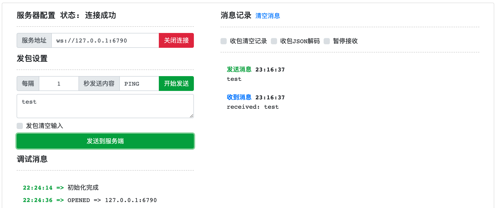

## 启动引擎

在开发阶段，我们使用 `dev` 模式，该模式会把 Center、Engine 两种节点一同启动，同时无需授权也拥有2CPU的执行能力。

```
% bin/connmix dev -f conf/connmix.yaml 

 _________________________________________________________________________________________________         
  ______________________________________________________________________________/\\\_______________      
   _____/\\\\\\\\_____/\\\\\_____/\\/\\\\\\____/\\/\\\\\\______/\\\\\__/\\\\\___\///___/\\\____/\\\_     
    ___/\\\//////____/\\\///\\\__\/\\\////\\\__\/\\\////\\\___/\\\///\\\\\///\\\__/\\\_\///\\\/\\\/__    
     __/\\\__________/\\\__\//\\\_\/\\\__\//\\\_\/\\\__\//\\\_\/\\\_\//\\\__\/\\\_\/\\\___\///\\\/____   
      _\//\\\________\//\\\__/\\\__\/\\\___\/\\\_\/\\\___\/\\\_\/\\\__\/\\\__\/\\\_\/\\\____/\\\/\\\___  
       __\///\\\\\\\\__\///\\\\\/___\/\\\___\/\\\_\/\\\___\/\\\_\/\\\__\/\\\__\/\\\_\/\\\__/\\\/\///\\\_ 
        ____\////////_____\/////_____\///____\///__\///____\///__\///___\///___\///__\///__\///____\///__
        
        connmix1.0.1, go1.17.5, lua5.1+bit64, darwin, arm64

2022-04-21 23:09:22.050391      WARN    commands/welcome.go:30  cpu underutilized, max_procs: 2, device_cpus: 8
2022-04-21 23:09:22.050759      INFO    center/server.go:46     start the center server 0.0.0.0:6787
2022-04-21 23:09:22.050852      INFO    registry/server.go:42   start the registry server (0.0.0.0:6786)
2022-04-21 23:09:22.050915      INFO    mesh/server.go:41       start the mesh point (0.0.0.0:6788)
2022-04-21 23:09:22.050932      INFO    ws/server.go:152        start the api server (0.0.0.0:6789)
2022-04-21 23:09:22.051414      INFO    lua/registrycli.go:36   center registry 127.0.0.1:6786 connect successful
2022-04-21 23:09:22.051433      INFO    lua/registrycli.go:76   register engine node_id c9gn78jin5670olm1rhg
2022-04-21 23:09:22.051858      INFO    registry/registry.go:118        register node 192.168.1.12 node_id c9gn78jin5670olm1rhg
2022-04-21 23:09:22.052021      INFO    lua/servers.go:96       start the lua server /Users/liujian/Documents/mycode/connmix/lua/entry.lua (0.0.0.0:6790)
2022-04-21 23:09:22.508174      INFO    ws/server.go:39 192.168.1.12:53033 websocket upgrade successfully
```

我们的入口文件 `lua/entry.lua` 执行的服务在 `6790` 端口，采用的是 `websocket` 协议。

## 编写业务逻辑

本次范例我们使用 [connmix-php](https://packagist.org/packages/connmix/connmix) 客户端来编写业务逻辑，基于 connmix 客户端，我们可以使用各种语言编写业务逻辑。

- 业务逻辑：当我们接收的消息是 `consume` 类型时，我们回复该消息。
- 查看更多 [PHP 客户端功能](/zh-cn/sdk-php)

```php
<?php

require __DIR__ . '/../vendor/autoload.php';

$client = \Connmix\ClientBuilder::create()
    ->setHost('127.0.0.1:6787')
    ->build();
$onConnect = function (\Connmix\AsyncNodeInterface $node) {
    // 消费内存队列
    $node->consume('foo');
};
$onReceive = function (\Connmix\AsyncNodeInterface $node) {
    $message = $node->message();
    switch ($message->type()) {
        case "consume":
            $clientID = $message->clientID();
            $data = $message->data();
            $node->meshSend($clientID, sprintf("received: %s", $data['frame']['data'] ?? ''));
            break;
        case "result":
            $success = $message->success();
            $fail = $message->fail();
            $total = $message->total();
            break;
        case "error":
            $error = $message->error();
            break;
        default:
            $payload = $message->payload();
    }
};
$onError = function (\Throwable $e) {
    // handle error
};
$client->do($onConnect, $onReceive, $onError);
```

## 测试

- 使用工具：http://www.easyswoole.com/wstool.html
- 我们连接 `ws://127.0.0.1:6790`
- 连接成功，并向该连接发送消息：`test`
- 我们将会收到 php 回复的 `received: test`




