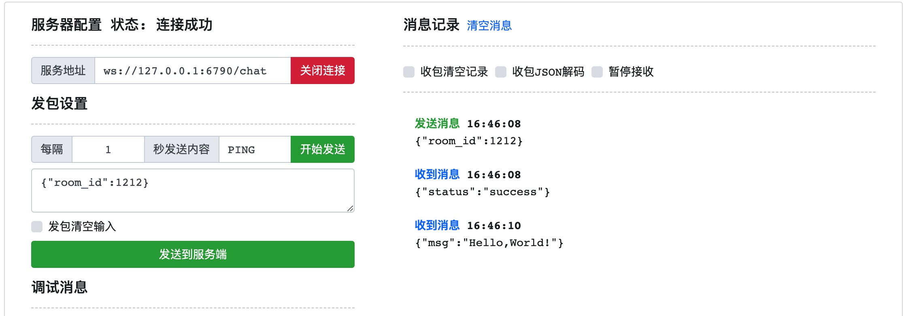

# Hello World 快速入门

## 启动引擎

在开发阶段，我们使用 `dev` 模式，该模式会把 Center、Engine 两种节点一同启动，同时**无需授权**也拥有2CPU的执行能力。

```
% bin/connmix dev -f conf/connmix.yaml 

 _________________________________________________________________________________________________         
  ______________________________________________________________________________/\\\_______________      
   _____/\\\\\\\\_____/\\\\\_____/\\/\\\\\\____/\\/\\\\\\______/\\\\\__/\\\\\___\///___/\\\____/\\\_     
    ___/\\\//////____/\\\///\\\__\/\\\////\\\__\/\\\////\\\___/\\\///\\\\\///\\\__/\\\_\///\\\/\\\/__    
     __/\\\__________/\\\__\//\\\_\/\\\__\//\\\_\/\\\__\//\\\_\/\\\_\//\\\__\/\\\_\/\\\___\///\\\/____   
      _\//\\\________\//\\\__/\\\__\/\\\___\/\\\_\/\\\___\/\\\_\/\\\__\/\\\__\/\\\_\/\\\____/\\\/\\\___  
       __\///\\\\\\\\__\///\\\\\/___\/\\\___\/\\\_\/\\\___\/\\\_\/\\\__\/\\\__\/\\\_\/\\\__/\\\/\///\\\_ 
        ____\////////_____\/////_____\///____\///__\///____\///__\///___\///___\///__\///__\///____\///__
        
        connmix1.0.3, go1.17.5, lua5.1+bitop, darwin, arm64

2022-08-05 16:19:31.780199      WARN    commands/welcome.go:30  cpu underutilized, max_procs: 2, device_cpus: 8
2022-08-05 16:19:31.780432      INFO    center/server.go:46     start the center server 0.0.0.0:6787
2022-08-05 16:19:31.780510      INFO    registry/server.go:42   start the registry server (0.0.0.0:6786)
2022-08-05 16:19:31.780571      INFO    apiserver/server.go:58  start the api server (0.0.0.0:6789)
2022-08-05 16:19:31.780643      INFO    mesh/server.go:42       start the mesh point (0.0.0.0:6788)
2022-08-05 16:19:31.781903      INFO    lua/registrycli.go:36   connect to center registry localhost:6786 success
2022-08-05 16:19:31.781925      INFO    lua/registrycli.go:80   register engine node_id vsemvqedsc
2022-08-05 16:19:31.782274      INFO    registry/registry.go:118        register node 192.168.1.16 node_id vsemvqedsc
2022-08-05 16:19:31.782376      INFO    lua/wsserver.go:60      start the websocket server /Users/liujian/Documents/mycode/connmix/lua/entry.websocket.lua (0.0.0.0:6790)
```

我们的入口文件 `lua/entry.websocket.lua` 执行的服务在 `6790` 端口，采用的是 `websocket` 协议。

## 编写服务端逻辑

示范一个聊天室主动推送Demo，修改 `entry.websocket.lua` 文件 `on_message` 方法的内容如下：

- 当用户发送 `{"room_id":1002}` 我们就给该连接订阅 `room:1002` 通道

> 通过 [Lua API](/zh-cn/lua-api) 我们可以编写各种复杂的业务逻辑

```lua
function on_message(msg)
	--print(msg)

	local tb, err = mix.json_decode(msg["data"])
	if err then
		mix_log(mix_DEBUG, "json_decode error: " .. err)
		return
	end
	if tb["room_id"] == nil then
		return
	end

	local conn = mix.websocket()
	conn:subscribe("room:" .. tb["room_id"])
	conn:send('{"status":"success"}')
end
```

- 接下来我们只需要在服务端给任意一个节点的 ApiServer 发送一下HTTP请求，就可以给该room发送消息。

```shell
curl --location --request POST 'http://127.0.0.1:6789/v1/mesh/publish' \
--header 'Content-Type: application/json' \
--data-raw '{
    "c": "room:1212",
    "d": "{\"msg\":\"Hello,World!\"}"
}'
```

## 测试

- 使用websocket测试工具连接 `ws://127.0.0.1:6790/chat`
- 连接成功，并向该连接发送消息 `{"room_id":1212}`
- 我们将会收到回复 `{"status":"success"}` 表示加入房间成功
- 调用 `curl` 主动推送后，房间内的所有人将会收到消息 `{"msg":"Hello,World!"}`


