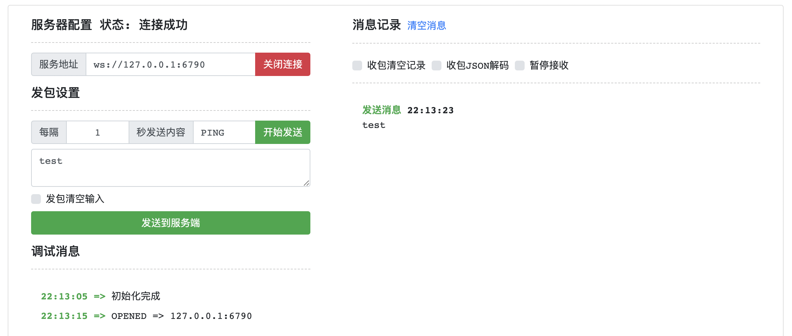
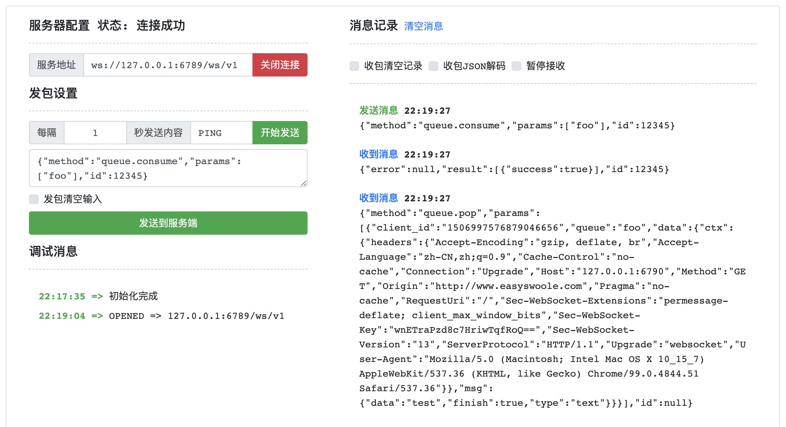
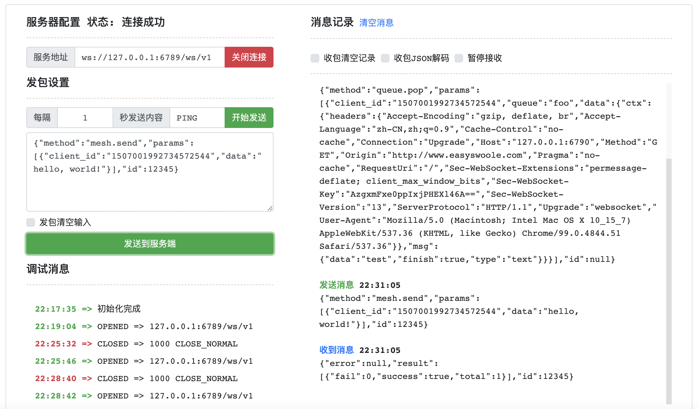
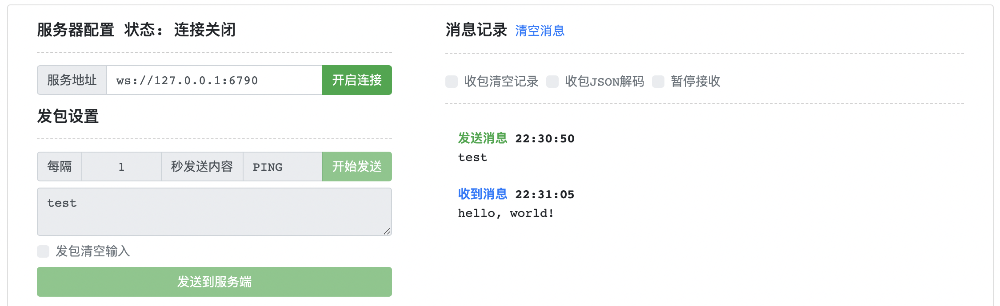

## API 调试

在开发阶段，我们使用 `dev` 模式，该模式会把 Center、Engine 两种节点一同启动，同时无需授权也拥有2CPU的执行能力。

```
% bin/connmix dev -f conf/connmix.yaml 

 _________________________________________________________________________________________________         
  ______________________________________________________________________________/\\\_______________      
   _____/\\\\\\\\_____/\\\\\_____/\\/\\\\\\____/\\/\\\\\\______/\\\\\__/\\\\\___\///___/\\\____/\\\_     
    ___/\\\//////____/\\\///\\\__\/\\\////\\\__\/\\\////\\\___/\\\///\\\\\///\\\__/\\\_\///\\\/\\\/__    
     __/\\\__________/\\\__\//\\\_\/\\\__\//\\\_\/\\\__\//\\\_\/\\\_\//\\\__\/\\\_\/\\\___\///\\\/____   
      _\//\\\________\//\\\__/\\\__\/\\\___\/\\\_\/\\\___\/\\\_\/\\\__\/\\\__\/\\\_\/\\\____/\\\/\\\___  
       __\///\\\\\\\\__\///\\\\\/___\/\\\___\/\\\_\/\\\___\/\\\_\/\\\__\/\\\__\/\\\_\/\\\__/\\\/\///\\\_ 
        ____\////////_____\/////_____\///____\///__\///____\///__\///___\///___\///__\///__\///____\///__
        
        connmix1.0.1, go1.17.5, lua5.1+bit64, darwin, arm64

2022-03-24 22:01:33.192724      WARN    commands/welcome.go:30  cpu underutilized, max_procs: 2, device_cpus: 8
2022-03-24 22:01:33.194576      INFO    registry/server.go:42   start the registry server (0.0.0.0:6786)
2022-03-24 22:01:33.194834      INFO    mesh/server.go:41       start the mesh node (0.0.0.0:6788)
2022-03-24 22:01:33.195094      INFO    ws/server.go:152        start the api server (0.0.0.0:6789)
2022-03-24 22:01:33.197122      INFO    protocol/registrycli.go:36      center registry 127.0.0.1:6786 connect successful
2022-03-24 22:01:33.197143      INFO    protocol/registrycli.go:76      register engine node_id c8u7jfbin5659oh0b13g
2022-03-24 22:01:33.197894      INFO    registry/registry.go:118        register node 192.168.2.101 node_id c8u7jfbin5659oh0b13g
2022-03-24 22:01:33.198072      INFO    protocol/servers.go:96  start the protocol server /Users/liujian/Documents/mycode/connmix/lua/entry.lua (0.0.0.0:6790)
```

我们的入口文件 `lua/entry.lua` 执行的服务在 `6790` 端口，采用的是 `websocket` 协议，我们来测试一下。

- 使用工具：http://www.easyswoole.com/wstool.html
- 我们连接 `ws://127.0.0.1:6790`
- 连接成功，并向该连接发送消息：`test`



接下来我们连接 API Server 来消费这个消息，ApiServer 的端口为 `6789`，也是 `websocket` 协议。

- 开启一个新网页打开 `wstool.html`
- 我们连接 `ws://127.0.0.1:6789/ws/v1`
- 发送消息: `{"method":"queue.consume","params":["foo"],"id":12345}`
- 然后我们收到了 `6790` 端口客户端发送的数据：`{"data":"test","finish":true,"type":"text"}` 和客户端连接的 `headers`
- 消息中包含一个 `client_id` 字段，该字段整个集群唯一，我们可以通过这个ID给这个连接回复消息。
- 当客户端再次发送消息时，这里将自动再次收到新的消息。



接下来我们通过 ApiServer 给图1的连接响应 `hello, world!`

- 发送消息：`{"method":"mesh.send","params":[{"client_id":"***","data":"hello, world!"}],"id":12345}`，消息中的 `client_id` 要替换为上图你收到的内容
- 这个过程要快一些，因为图1的连接会在 `60s` 被服务器断开，因为 `connmix.yaml` 中配置了这个超时。
- 如果发送失败，就是因为这个 `client_id` 已经断线了，需要重复上面的全部过程。



- 成功后，你在图1的连接将会收到我们通过 ApiServer 发送给客户端的消息：`hello, world!`



以上过程详细记录了 connmix 执行的基本流程，当然全部功能远不止这些，还有 pubsub, context 等更多玩法。

## API 协议

掌握该协议，用户可以自己定制 connmix 客户端，普通用户直接使用官方客户端即可。

> 协议：`websocket` 默认端口：`6789` 路径: `/ws/v1`

### ping/pong

Request

```json
{"method":"server.ping","params":[],"id":12345}
```

Response

```json
{"error":null,"result":{"status":"server.pong"},"id":12345}
```

### 消费队列

Request

```json
{"method":"queue.consume","params":["foo"],"id":12345}
```

Response

```json
{"error":null,"result":{"success":true},"id":12345}
```

Error

- `101` 参数无效
- `201` 消费失败
- `202` 重复消费

```json
{"error":{"code":202,"message":"*****"},"id":12345}
```

Event

```json
{"event":"queue.consume","result":{"client_id":"1463819408261513216","queue":"foo","data":{"ctx":[],"msg":"foo"}},"id":null}
```

### 取消队列消费

> 暂时只支持取消全部

Request

```json
{"method":"queue.unconsume","params":[],"id":12345}
```

Error

- `203` 取消消费失败

```json
{"error":{"code":202,"message":"*****"},"id":12345}
```

Response

```json
{"error":null,"result":{"success":true},"id":12345}
```

### 远程执行 `conn` 设置上下文

Request

```json
{"method":"conn.call","params":[{"client_id":"1458271556210786304","func":"set_context_value","args":["user_id",10000]}],"id":12345}
```

Response

```json
{"error":null,"result":{"success":true},"id":12345}
```

Error

- `101` 参数无效
- `301` 执行失败

```json
{"error":{"code":301,"message":"*****"},"id":12345}
```

### 远程执行 `conn` 订阅频道

Request

```json
{"method":"conn.call","params":[{"client_id":"1463784730422935552","func":"subscribe","args":["channel1","channel2"]}],"id":12345}
```

Response

```json
{"error":null,"result":{"success":true},"id":12345}
```

Error

- `101` 参数无效
- `301` 执行失败

```json
{"error":{"code":301,"message":"*****"},"id":12345}
```

### 网格发送：可以发送给整个网格的任意机器的客户端连接

Request

```json
{"method":"mesh.send","params":[{"client_id":"1463786910324359168","data":"123456789"}],"id":12345}
```

Response

```json
{"error":null,"result":{"fail":0,"success":true,"total":1},"id":12345}
```

Error

- `101` 无效参数
- `401` 发送失败

```json
{"error":{"code":401,"message":"*****"},"id":12345}
```

### 网格发布：可以发送给整个网格内所有订阅了这些频道的客户端连接

Request

```json
{"method":"mesh.publish","params":[{"channel":"channel1","data":"123456789"}],"id":12345}
```

Response

```json
{"error":null,"result":{"fail":0,"success":true,"total":9},"id":12345}
```

Error

- `101` 无效参数

```json
{"error":{"code":401,"message":"*****"},"id":12345}
```
