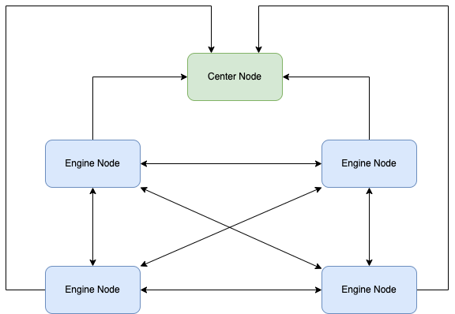
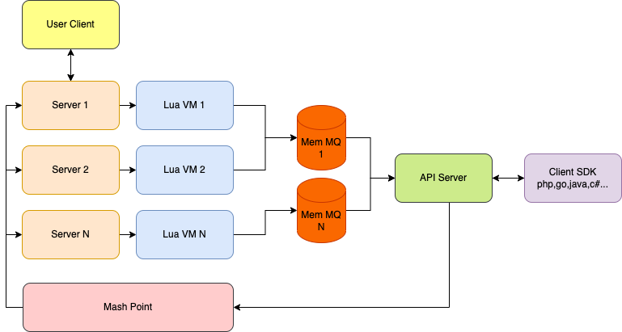

# 工作原理

## 服务网格

- 整个系统由 Center Node、Engine Node 两种节点组成。
- Center Node 负责服务注册，Engine Node 负责逻辑处理。
- Engine Node 启动都会向 Center Node 注册。
- Engine Node 之间会自动组网，形成服务网格，因此每个节点的连接都可以和其他节点的的连接通讯。
- Engine Node 的注册和组网是自动完成的，因此如果性能或者连接数不够，启动一个新的 Engine Node 即可完成扩容。
- Engine Node 本身就是各种通讯协议的 server，对外提供服务，外部请求直接连接 Engine Node 的端口。

## 引擎节点

- Server 负责对外提供服务，接受和响应TCP数据，每个 Server 执行一套 Lua 代码，启动一个独立的 Lua VM 负责解析TCP数据流，完成特定的网络协议解析，如：websocket、http 等。
- Lua VM 中的自定义协议代码，通过 Lua API 可以将解析后的数据 push 到内存队列 MQ 中。
- Client SDK 与 Engine Node 通过 ApiServer 来通讯，目前是 websocket 协议 (text)，后续会扩展 binary。
- 通过 Client SDK 我们可以使用任何语言来消费解析后的请求数据，消费完成后我们还可以通过 Client SDK 指定 client_id 来响应到对应的连接。
- 如果响应的 client_id 不在本节点，Engine Node 将自动寻找到对应节点的 Mash Point 转发过去，因此我们使用时整个集群就像同一台机器一样方便。
