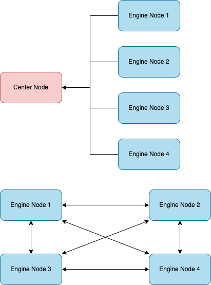

# 工作原理

## 服务网格

- 整个系统由 Center、Engine 两种节点组成。
- Center 节点负责服务注册，Engine 节点负责逻辑处理。
- Engine 节点启动都会向 Center Node 注册。
- Engine 节点之间会自动组网，形成服务网格，因此每个节点的连接都可以和其他节点的的连接通讯。
- Engine 节点的注册和组网是自动完成的，因此如果性能或者连接数不够，启动一个新的 Engine 节点即可完成扩容。
- Engine 节点本身就是各种通讯协议的 server，对外提供服务，外部请求直接连接 Engine 节点的端口。

## 引擎节点

- Server 负责对外提供服务，根据配置的协议类型接受和响应数据，每个 Server 执行一套 Lua 代码，启动一个独立的 Lua VM 执行业务逻辑。
- websocket 协议：Lua 代码中可以编写业务逻辑，比如：将上报的数据push到redis，或者订阅某个channel实现主动推送。
- socket 协议：除了业务逻辑外，还可以使用Lua代码自定义网络通讯协议，通过 Lua API 可以解析协议内的数据。
- 通过 ApiServer 我们可以调用 http/websocket api 来完成主动推送。
- 调用 ApiServer 执行 send,publish 时如果 client_id 不在本节点，Engine Node 将自动寻找到对应节点的 Mash Point 转发过去，因此使用时用户无需处理跨机器带来的分布式问题。
